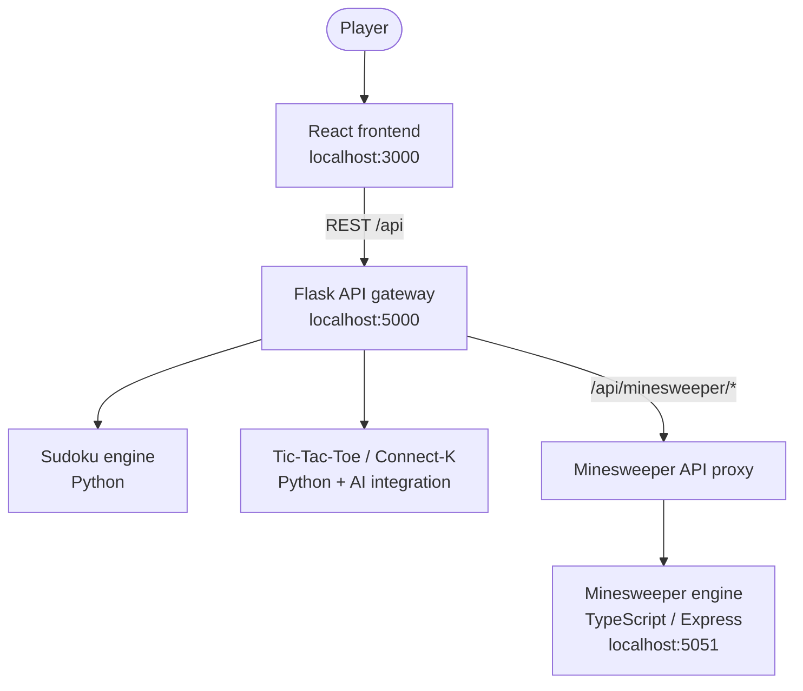

<h1 align="center">ITU Collaborative Semestral Project</h1>

<p align="center"><strong>yIQ – Your interactive guide to logic games</strong></p>

<p align="center">A unified, educational web application for <strong>Sudoku, Tic-Tac-Toe, and Minesweeper</strong>.<br>Explore classic logic games, learn useful strategies, and develop problem-solving skills through a consistent, interactive interface.</p>

[](https://www.gnu.org/licenses/gpl-3.0.en.html)
[](https://react.dev/)
[](https://www.python.org/)
[](https://flask.palletsprojects.com/)
[](https://www.typescriptlang.org/)
[](https://nodejs.org/)


<p align="center"><sub>Brno University of Technology · Faculty of Information Technology · ITU — User Interface Programming · Academic year 2025/2026</sub></p>

<p align="center">
  <a href="https://jolly-ocean-0bad52203.1.azurestaticapps.net/"><strong>🎮 Play yIQ online</strong></a>
  &nbsp;·&nbsp;
  <a href="#getting-started">Run locally</a>
  &nbsp;·&nbsp;
  <a href="#documentation">Documentation</a>
</p>

---

## Authors

yIQ was developed by a three-member student team at the **Faculty of Information Technology, Brno University of Technology (FIT BUT)** as part of the **ITU — User Interface Programming** course.

| Author | University ID | Primary game contribution |
| --- | --- | --- |
| **Jan Kalina** | `xkalinj00` | Minesweeper |
| **David Krejčí** | `xkrejcd00` | Sudoku |
| **Hana Liškařová** | `xliskah00` | Tic-Tac-Toe / Connect-K |

Beyond their respective games, all three authors contributed to the shared application through design, integration, and team testing. For more detail, see the [team overview](#team) and the [file-by-file authorship breakdown](#detailed-project-structure-based-on-authorship).

---

## Overview

yIQ is a student-developed collection of **three classic logic games** designed around a shared visual language, approachable controls, and interactive learning. Rather than presenting three unrelated games, the project combines them into a coherent web experience with dedicated **gameplay**, **settings**, and **strategy** views.

The project was developed by a three-member team as part of the **ITU (User Interface Programming)** course at the Faculty of Information Technology, Brno University of Technology (FIT BUT). Its development included user research, analysis of existing applications, interface mockups, software architecture design, implementation, and team testing.

**Try it online:** [Launch the yIQ web application](https://jolly-ocean-0bad52203.1.azurestaticapps.net/).

### Choose your game

| Sudoku | Tic-Tac-Toe | Minesweeper |
|:---:|:---:|:---:|
|  |  |  |
| Number-placement puzzles with assistance, notes, and multiple ways to play. | Classic and configurable connect-in-a-row gameplay against people or AI. | Discover safe cells, flag mines, and improve deduction with visual hints and strategy lessons. |

### Highlights

- **Three games, one cohesive interface** — consistent navigation, game cards, styling, and reusable components.
- **Learn as you play** — in-game hints, dedicated strategy pages, and explanations of core techniques.
- **Personalized gameplay** — per-game configuration, difficulty choices, and interaction settings.
- **Separate client and server** — React frontend backed by REST APIs and modular game services.
- **Research-driven design** — requirements gathering, competitor analysis, detailed UI mockups, and usability testing.
- **Team-developed** — shared application components alongside individually owned game implementations.

## Contents

- [Authors](#authors)
- [Overview](#overview)
  - [Choose your game](#choose-your-game)
  - [Highlights](#highlights)
- [Contents](#contents)
- [Games and Features](#games-and-features)
  - [Sudoku](#sudoku)
  - [Tic-Tac-Toe / Connect-K](#tic-tac-toe--connect-k)
  - [Minesweeper](#minesweeper)
- [Technology Stack](#technology-stack)
- [Architecture](#architecture)
- [Getting Started](#getting-started)
  - [Prerequisites](#prerequisites)
  - [1. Clone the repository](#1-clone-the-repository)
  - [2. Set up the Python backend](#2-set-up-the-python-backend)
  - [3. Install the Minesweeper backend dependencies](#3-install-the-minesweeper-backend-dependencies)
  - [4. Install the React frontend dependencies](#4-install-the-react-frontend-dependencies)
- [Running the Application](#running-the-application)
  - [Useful development commands](#useful-development-commands)
- [Testing](#testing)
- [Documentation](#documentation)
- [Team](#team)
- [General Project Structure](#general-project-structure)
- [Project grading from the University (BUT FIT)](#project-grading-from-the-university-but-fit)
  - [Phase I: Requirements, Design, and Application Foundation](#phase-i-requirements-design-and-application-foundation)
  - [Phase II: Final Application (GUI Client)](#phase-ii-final-application-gui-client)
    - [General](#general)
    - [Minesweeper](#minesweeper-1)
  - [Phase III: Defense, Conclusion, and Notes (Including Potential Penalties)](#phase-iii-defense-conclusion-and-notes-including-potential-penalties)
- [Detailed Project Structure Based on Authorship](#detailed-project-structure-based-on-authorship)
- [License](#license)

---

## Games and Features

### Sudoku

A logic-based number-placement game with multiple puzzle modes and configurable assistance.

- Prebuilt and generated puzzles, plus a learning-oriented mode.
- Notes/candidate entry, hints, and mistake checking.
- Configurable input behavior, highlighting, and game preferences.
- Dedicated game, settings, and strategy screens.
- Game logic and session management implemented in the Python backend.

**Main implementation:** [`src/Frontend/src/sudoku/`](src/Frontend/src/sudoku/) · [`src/Backend/sudoku/`](src/Backend/sudoku/)

### Tic-Tac-Toe / Connect-K

An expanded take on Tic-Tac-Toe, with customizable boards and win conditions.

- Player-versus-player and player-versus-AI gameplay.
- Configurable board dimensions and connect-in-a-row win conditions.
- Move validation, victory/draw detection, and game state handling.
- AI move suggestions and explanations through the backend.
- Dedicated game and strategy interfaces with configurable settings.

**Main implementation:** [`src/Frontend/src/tic_tac_toe/`](src/Frontend/src/tic_tac_toe/) · [`src/Backend/tic_tac_toe/`](src/Backend/tic_tac_toe/)

### Minesweeper

A modern Minesweeper interface emphasizing both usability and learning.

- Preset difficulty levels and custom game settings.
- Cell revealing, flagging, quick-flag interactions, and a protected first move.
- Hints, game-state controls, and a zoomable/pannable board.
- Strategy content ranging from basic patterns to advanced deduction and efficiency.
- Modular frontend and a dedicated TypeScript game service.

**Main implementation:** [`src/Frontend/src/minesweeper/`](src/Frontend/src/minesweeper/) · [`src/Backend/minesweeper/`](src/Backend/minesweeper/)

---

## Technology Stack

| Layer | Technologies | Role |
| --- | --- | --- |
| Frontend | React 18, React Router, JavaScript/JSX | Shared UI, routing, interactive game interfaces |
| API gateway / backend | Python 3.11+, Flask 3, Flask-CORS | REST endpoints, Sudoku and Tic-Tac-Toe services, Minesweeper proxy |
| Minesweeper service | Node.js, TypeScript 5, Express | Dedicated game engine, state handling, and HTTP API |
| Supporting libraries | NumPy, Axios, Lucide React, DnD Kit | Game-related computation, HTTP communication, icons, interactions |
| Testing | pytest, JavaScript smoke tests | Backend and API test coverage |
| Deployment configuration | Azure Pipelines, Azure Static Web Apps / Web Apps | CI/CD and application hosting configuration |

## Architecture

The browser communicates with a single Flask API gateway. The gateway handles Sudoku and Tic-Tac-Toe itself, while **Minesweeper requests are forwarded to a separate Express/TypeScript service**. During local development, React's development server proxies `/api` requests to Flask.



| Service | Local address | Implementation |
| --- | --- | --- |
| Frontend | `http://localhost:3000` | [`src/Frontend/`](src/Frontend/) |
| Flask backend | `http://localhost:5000` | [`src/Backend/app.py`](src/Backend/app.py) |
| Minesweeper backend | `http://localhost:5051` | [`src/Backend/minesweeper/`](src/Backend/minesweeper/) |

Available Flask API entry points include `/api/health`, `/api/games`, `/api/sudoku/*`, `/api/tictactoe/*`, and `/api/minesweeper/*`.

---

## Getting Started

### Prerequisites

- **Python 3.11 or newer**, with `pip` and `venv`.
- **Node.js 18+** and **npm**. The Minesweeper backend declares support for Node.js 18–22.
- **Git** (recommended, to initialize the Tic-Tac-Toe AI submodule).

> [!IMPORTANT]
> The complete application requires **three services** for local Minesweeper functionality: Flask, the React development server, and the separate Node.js/TypeScript Minesweeper backend. Tic-Tac-Toe and Sudoku require only **two services** (Flask and the React development server).

### 1. Clone the repository

```bash
git clone --recurse-submodules <repository-url>
cd <repository-directory>
```

For an existing Git checkout, initialize the external Tic-Tac-Toe AI dependency with:

```bash
git submodule update --init --recursive
```

> If you are using a downloaded ZIP instead of a Git clone, the `omega_gomoku_ai` submodule may not be bundled. See [third-party notices](src/Backend/third_party/THIRD_PARTY_NOTICES.md).

### 2. Set up the Python backend

Run these commands **from the repository root**:

```bash
python -m venv venv
```

Activate the virtual environment:

```bash
# Linux / macOS
source venv/bin/activate
```

```powershell
# Windows PowerShell
.\venv\Scripts\Activate.ps1
```

Install the Python dependencies:

```bash
python -m pip install -r requirements.txt
```

### 3. Install the Minesweeper backend dependencies

```bash
cd src/Backend/minesweeper
npm install
cd ../../..
```

This service has its own `package.json`. Its `postinstall` script builds the TypeScript sources.

### 4. Install the React frontend dependencies

```bash
cd src/Frontend
npm install
cd ../..
```

---

## Running the Application

Open **three terminals** in the repository root and start each service independently.

**Terminal 1 — Flask API:**

```bash
# Activate venv first if it is not already active
source venv/bin/activate  # Linux / macOS
cd src/Backend
python app.py
```

For **Windows**, activate the environment using `venv\Scripts\activate` (Command Prompt) or `.\venv\Scripts\Activate.ps1` (PowerShell) before changing directories.

**Terminal 2 — Minesweeper (TypeScript / Express):**

```bash
cd src/Backend/minesweeper
npm run dev
```

**Terminal 3 — React frontend:**

```bash
cd src/Frontend
npm start
```

Open **http://localhost:3000** in your browser. The frontend forwards API requests to Flask on port `5000`, and Flask forwards Minesweeper operations to the service on port `5051`.

### Useful development commands

| Command | Run from | Purpose |
| --- | --- | --- |
| `python app.py` | `src/Backend/` | Launch Flask API |
| `npm run dev` | `src/Backend/minesweeper/` | Run the TypeScript Minesweeper service |
| `npm run build` | `src/Backend/minesweeper/` | Compile the TypeScript service |
| `npm start` | `src/Frontend/` | Launch the React development server |
| `npm run build` | `src/Frontend/` | Create an optimized frontend build |
| `npm test` | `src/Frontend/` | Run the React test script |

> [!NOTE]
> The root `package.json` contains helper npm scripts using lowercase `src/frontend` and `src/backend` paths. On case-sensitive systems, use the commands above with the actual **`src/Frontend`** and **`src/Backend`** directory names. The backend's default development credentials and permissive CORS settings are intended for local development, not production hardening.

---

## Testing

The repository contains Python tests for the Tic-Tac-Toe backend, alongside JavaScript smoke tests for its client integration.

```bash
# From repository root, with the Python virtual environment active
python -m pip install pytest
python -m pytest tests/tic_tac_toe
```

The JavaScript smoke-test instructions are in [`tests/tic_tac_toe/js/TTT-JS-TESTS-README.md`](tests/tic_tac_toe/js/TTT-JS-TESTS-README.md).

The project also includes a React test script (`npm test` from `src/Frontend/`). No new test run is claimed here; the university assessment is reproduced below from the original README.

---

## Documentation

| Resource | Contents |
| --- | --- |
| [Requirements and design report (PDF)](doc/navrh_itu.pdf) | User interviews, application review, requirements, mockups, architectural design, and proposed APIs |
| [Project presentation (PDF)](doc/prezentace_itu.pdf) | Project goals, technology choices, implementation, and team work allocation |
| [Original course assignment (PDF)](info/zadani_projektu_2025_26.pdf) | ITU project assignment for the academic year 2025/2026 |
| [Tic-Tac-Toe backend documentation](src/Backend/tic_tac_toe/README_tic-tac-toe.md) | Connect-K API, state format, AI integration, and configuration |
| [Tic-Tac-Toe OpenAPI specification](src/Backend/openapi.tictactoe.yaml) | API contract for the game service |
| [Third-party notices](src/Backend/third_party/THIRD_PARTY_NOTICES.md) | Attribution for the external Omega_Gomoku_AI dependency |

---

## Team

**Team `xkalinj00` · Brno University of Technology (FIT BUT)**

| Team member | University ID | Primary frontend focus |
| --- | --- | --- |
| **Jan Kalina** | `xkalinj00` | Minesweeper |
| **David Krejčí** | `xkrejcd00` | Sudoku |
| **Hana Liškařová** | `xliskah00` | Tic-Tac-Toe |

The application also includes **collaborative work** on shared components, navigation, interface conventions, design, and integration. The original file-by-file authorship breakdown is preserved later in this README.

---

## General Project Structure

> The following is the **abbreviated directory overview from the original README** (retained as supplied). The actual repository also contains additional backends, tests, documentation, configuration files, and the TypeScript Minesweeper service described above.

```plaintext
project-root/
├── .gitignore
├── README.md
├── azure-frontend-pipeline.yml
├── azure-pipelines.yml
├── package.json
├── requirements.txt
└── src/
    ├── Backend/
    │   └── app.py
    └── Frontend/
        ├── public/
        │   └── index.html
        ├── src/
        │   ├── App.jsx
        │   └── index.js
        └── package.json
```

> Note: This is a simplified tree; the complete file-by-file authorship listing appears below.

---

## Project grading from the University (BUT FIT)

**Result:** 54.0 / 55.0 b.

### Phase I: Requirements, Design, and Application Foundation

**Reviewer:** Ing. Michal Kapinus, Ph.D.

The interviews with potential users are described in excessive detail. Rather than providing verbatim transcripts of all responses (including questions with predefined answer scales, such as "How often do you play? Often, occasionally, never?"), it would have been more appropriate to focus on analyzing these responses. Almost all questions focus on users' motivation to play logic games and their evaluation of individual features, while only marginally addressing how users actually play these games, what they find frustrating about existing solutions, and how the games could be made easier for them.

The review of existing applications is well executed. The detailed textual descriptions of every button, setting, and other GUI component are rather unnecessary at this stage and feel somewhat like filler. Nevertheless, the authors identified the essential aspects of the application that need to be addressed during the design process.

The user interface designs are very well developed, although certain parts could have focused more closely on the actual user interactions (e.g., entering a number in Sudoku). As in the first part, the authors often go into unnecessary detail, which makes the text excessively long. In particular, the non-interactive parts of the design (pages covering rules and strategies) are not so essential to the application that they warrant such extensive coverage.

I appreciate the effort the authors put into creating mockups representing different stages of gameplay, demonstrating that they have considered most situations that may arise during a game. The individual games share a common visual design, giving the application a consistent appearance throughout.

For Tic-Tac-Toe, it would be interesting to experiment with a larger playing field (e.g., an infinite board), which would introduce additional challenges in terms of navigating and moving around the board. On such a board, previous inactive games could remain visible, forming natural barriers (similar to repeatedly playing on the same sheet of graph paper).

The proposed architecture is clearly described, including all frameworks and communication technologies used. The data structures are also documented, and the API is defined.

### Phase II: Final Application (GUI Client)

**Reviewer:** Ing. Marek Vaško

#### General

The technical report contains all the essential information necessary to understand the implementation.

Team testing is generally well executed. A total of six testers participated in the testing process, with a brief summary provided for each tester and clearly stated conclusions from the testing conducted by individual team members.

#### Minesweeper

Kalina implemented an application for Minesweeper. The implementation is clearly organized into modules and follows the conventions of the chosen framework. All important parts of the implementation are properly documented and commented.

### Phase III: Defense, Conclusion, and Notes (Including Potential Penalties)

**Defense Committee:**

- Ing. Marek Vaško
- doc. Ing. Vítězslav Beran, Ph.D.

---

## Detailed Project Structure Based on Authorship

- <span style="color:turquoise">Jan Kalina (xkalinj00)</span>
- <span style="color:moccasin">David Krejčí (xkrejcd00)</span>
- <span style="color:lightpink">Hana Liškařová (xliskah00)</span>
- Rest are collaborative works

<pre>
Frontend/
├── <span style="color:lightpink">About.jsx</span>
├── App.jsx
├── package.json
├── public
│   └── index.html
└── src
    ├── assets
    │   ├── home
    │   │   ├── <span style="color:turquoise">MinesweeperIcon.svg</span>
    │   │   ├── <span style="color:turquoise">SudokuIcon.svg</span>
    │   │   └── <span style="color:turquoise">TicTacToeIcon.svg</span>
    │   ├── icons
    │   │   ├── <span style="color:turquoise">DragAFlagIcon.jsx</span>
    │   │   ├── <span style="color:turquoise">HintIcon.jsx</span>
    │   │   ├── <span style="color:turquoise">PauseIcon.jsx</span>
    │   │   ├── <span style="color:turquoise">PlayIcon.jsx</span>
    │   │   ├── <span style="color:turquoise">QuickFlagOffIcon.jsx</span>
    │   │   ├── <span style="color:turquoise">QuickFlagOnIcon.jsx</span>
    │   │   ├── <span style="color:turquoise">RestartIcon.jsx</span>
    │   │   ├── <span style="color:turquoise">ResumeIcon.jsx</span>
    │   │   ├── <span style="color:turquoise">StrategyIcon.jsx</span>
    │   │   └── <span style="color:turquoise">UndoIcon.jsx</span>
    │   ├── minesweeper
    │   │   ├── <span style="color:turquoise">About</span>
    │   │   ├── <span style="color:turquoise">AdvancedLogic</span>
    │   │   ├── <span style="color:turquoise">AdvancedPatterns</span>
    │   │   ├── <span style="color:turquoise">BasicPatterns</span>
    │   │   ├── <span style="color:turquoise">BlackHeart.jsx</span>
    │   │   ├── <span style="color:turquoise">Efficiency</span>
    │   │   ├── <span style="color:turquoise">FlaggedCellTexture.jsx</span>
    │   │   ├── <span style="color:turquoise">FlaggingModeCellTexture.jsx</span>
    │   │   ├── <span style="color:turquoise">Flag.jsx</span>
    │   │   ├── <span style="color:turquoise">Guessing</span>
    │   │   ├── <span style="color:turquoise">Mine.jsx</span>
    │   │   ├── <span style="color:turquoise">NoFlag</span>
    │   │   ├── <span style="color:turquoise">PatternReduction</span>
    │   │   ├── <span style="color:turquoise">RedHeart.jsx</span>
    │   │   └── <span style="color:turquoise">UnopenedCellTexture.jsx</span>
    │   └── tic_tac_toe
    │       ├── <span style="color:lightpink">back.svg</span>
    │       ├── <span style="color:lightpink">bestmove.svg</span>
    │       ├── <span style="color:lightpink">info.svg</span>
    │       ├── <span style="color:lightpink">newgame.svg</span>
    │       ├── <span style="color:lightpink">pause.svg</span>
    │       ├── <span style="color:lightpink">restart.svg</span>
    │       ├── <span style="color:lightpink">settings.svg</span>
    │       └── <span style="color:lightpink">shutdown.svg</span>
    ├── Colors.jsx
    ├── components
    │   ├── <span style="color:turquoise">Banner.jsx</span>
    │   ├── <span style="color:turquoise">BoxButton.jsx</span>
    │   ├── <span style="color:moccasin">Box.jsx</span>
    │   ├── <span style="color:moccasin">ButtonSelect.jsx</span>
    │   ├── <span style="color:turquoise">GameCard.jsx</span> <span style="color:moccasin">(+David Krejčí)</span>
    │   ├── <span style="color:moccasin">Header.jsx</span> <span style="color:turquoise">(+Jan Kalina)</span>
    │   ├── <span style="color:moccasin">IconButton.jsx</span>
    │   ├── <span style="color:moccasin">IconTextButton.jsx</span>
    │   ├── <span style="color:turquoise">Loader.jsx</span>
    │   ├── <span style="color:turquoise">NumberField.jsx</span>
    │   ├── <span style="color:lightpink">Person.jsx</span>
    │   ├── <span style="color:moccasin">SettingsRow.jsx</span>
    │   ├── <span style="color:turquoise">Slider.jsx</span>
    │   └── <span style="color:turquoise">ToggleButton.jsx</span>
    ├── Home.jsx
    ├── hooks
    │   ├── <span style="color:turquoise">ImageUrlCache.js</span>
    │   └── <span style="color:turquoise">RenderImage.jsx</span>
    ├── index.js
<div style="color:turquoise">
    ├── minesweeper
    │   ├── components
    │   │   ├── MinesweeperCommonComponents
    │   │   │   ├── MinesweeperBoxButton.jsx
    │   │   │   ├── MinesweeperButtonSelect.jsx
    │   │   │   ├── MinesweeperInfoPanel.jsx
    │   │   │   ├── MinesweeperNumberField.jsx
    │   │   │   ├── MinesweeperSettingsRow.jsx
    │   │   │   ├── MinesweeperSlider.jsx
    │   │   │   └── MinesweeperToggleButton.jsx
    │   │   ├── MinesweeperGameComponents
    │   │   │   ├── ActionBar.jsx
    │   │   │   ├── ActionButton.jsx
    │   │   │   ├── ActionPill.jsx
    │   │   │   ├── GameInfoPanel.jsx
    │   │   │   ├── GameLayout.jsx
    │   │   │   ├── GameLoader.jsx
    │   │   │   ├── GameOverControls.jsx
    │   │   │   ├── HintOverlay.jsx
    │   │   │   ├── LostOnControls.jsx
    │   │   │   ├── MineCell.jsx
    │   │   │   ├── MineGrid.jsx
    │   │   │   ├── OverlayButton.jsx
    │   │   │   └── PanZoomViewport.jsx
    │   │   ├── MinesweeperSettingsComponents
    │   │   │   ├── DifficultyRow.jsx
    │   │   │   ├── GameBasicsPanel.jsx
    │   │   │   ├── GameplayPanel.jsx
    │   │   │   ├── SettingsLayout.jsx
    │   │   │   ├── SettingsLoader.jsx
    │   │   │   ├── SliderWithNumberControl.jsx
    │   │   │   └── ToggleRow.jsx
    │   │   └── MinesweeperStrategyComponents
    │   │       ├── StrategyBox.jsx
    │   │       └── StrategyPill.jsx
    │   ├── controllers
    │   │   ├── MinesweeperApiController.jsx
    │   │   ├── MinesweeperGameController.jsx
    │   │   ├── MinesweeperSettingsController.jsx
    │   │   └── MinesweeperStrategyController.jsx
    │   ├── hooks
    │   │   ├── MinesweeperGameHooks.jsx
    │   │   └── UseMediaQuery.js
    │   ├── models
    │   │   ├── MinesweeperApiClient.jsx
    │   │   ├── MinesweeperGame
    │   │   │   ├── MinesweeperGameAPI.jsx
    │   │   │   └── MinesweeperGameRenderHelpers.jsx
    │   │   ├── MinesweeperSettings
    │   │   │   ├── MinesweeperSettingsAPI.jsx
    │   │   │   ├── MinesweeperSettingsBuilders.jsx
    │   │   │   └── MinesweeperSettingsState.jsx
    │   │   └── MinesweeperStorageKeys.jsx
    │   ├── styles
    │   │   ├── MinesweeperGameStyles.jsx
    │   │   ├── MinesweeperSettingsStyles.jsx
    │   │   └── MinesweeperStrategyStyles.jsx
    │   └── views
    │       ├── MinesweeperGameView.jsx
    │       ├── MinesweeperSettingsView.jsx
    │       └── MinesweeperStrategyView.jsx
</div>
    ├── Styles.jsx
<div style="color:moccasin">
    ├── sudoku
    │   ├── components
    │   │   ├── Grid.jsx
    │   │   └── NumberSelect.jsx
    │   ├── controllers
    │   │   ├── GameController.jsx
    │   │   ├── NavigationController.jsx
    │   │   ├── SettingsController.jsx
    │   │   └── SudokuController.jsx
    │   ├── models
    │   │   ├── APIMappers.js
    │   │   ├── GameInfoModel.jsx
    │   │   ├── GridModel.jsx
    │   │   ├── HistoryModel.jsx
    │   │   ├── ServerCommunicationModel.jsx
    │   │   ├── SettingsModel.jsx
    │   │   └── StatusModel.jsx
    │   ├── Sudoku.jsx
    │   └── views
    │       ├── Game.jsx
    │       ├── Loading.jsx
    │       ├── Selection.jsx
    │       ├── Settings.jsx
    │       └── Strategy.jsx
</div>
<div style="color:lightPink">
    └── tic_tac_toe
        ├── javascript
        │   ├── client.js
        │   ├── constants.js
        │   ├── env.js
        │   ├── package.json
        │   └── ttt.client.js
        ├── react
        │   ├── components
        │   │   ├── best_move
        │   │   │   ├── bestMoveHint.jsx
        │   │   │   └── bestMoveOverlay.jsx
        │   │   ├── board.jsx
        │   │   ├── card.jsx
        │   │   ├── connectOptions.jsx
        │   │   ├── icons
        │   │   │   ├── backIcon.jsx
        │   │   │   ├── bestMoveIcon.jsx
        │   │   │   ├── index.js
        │   │   │   ├── infoIcon.jsx
        │   │   │   ├── newGameIcon.jsx
        │   │   │   ├── pauseIcon.jsx
        │   │   │   ├── powerIcon.jsx
        │   │   │   ├── restartIcon.jsx
        │   │   │   └── settingsIcon.jsx
        │   │   ├── infoPanels
        │   │   │   ├── base
        │   │   │   │   ├── defeatInfoPanelBase.jsx
        │   │   │   │   ├── infoPanelBase.jsx
        │   │   │   │   └── winnerInfoPanelBase.jsx
        │   │   │   ├── drawInfoPanel.jsx
        │   │   │   ├── gameInfoPanel.jsx
        │   │   │   ├── loseInfoPanel.jsx
        │   │   │   ├── oWinInfoPanel.jsx
        │   │   │   ├── pvpInfoPanel.jsx
        │   │   │   ├── spectatorInfoPanel.jsx
        │   │   │   ├── timeRanOutPanel.jsx
        │   │   │   ├── winInfoPanel.jsx
        │   │   │   └── xWinInfoPanel.jsx
        │   │   ├── marks
        │   │   │   ├── markO.jsx
        │   │   │   └── markX.jsx
        │   │   ├── pill.jsx
        │   │   ├── playerBadge.jsx
        │   │   ├── resultStatsGrid.jsx
        │   │   ├── settings
        │   │   │   ├── numberBox.jsx
        │   │   │   ├── pillRadioRow.jsx
        │   │   │   ├── playersEditor.jsx
        │   │   │   ├── previewStatRow.jsx
        │   │   │   ├── settingsSliderRow.jsx
        │   │   │   └── settingsToolbar.jsx
        │   │   ├── toolbar
        │   │   │   ├── afterGameToolbar.jsx
        │   │   │   ├── toolbar.jsx
        │   │   │   └── toolbarLayout.jsx
        │   │   └── underHeader.jsx
        │   ├── hooks
        │   │   ├── gameContext.js
        │   │   ├── useGame.js
        │   │   ├── useInfoPanelLayout.js
        │   │   └── useMeasuredSliderWidth.js
        │   └── pages
        │       ├── GamePage.jsx
        │       ├── GameSettingsPage.jsx
        │       └── StrategyPage.jsx
        └── tic_tac_toe.jsx
</div>
</pre>

---

## License

yIQ is made available under the **GNU General Public License, version 3 (GPLv3)**. You may use, modify, and redistribute the project in accordance with the terms of the [GNU GPLv3 license](https://www.gnu.org/licenses/gpl-3.0.en.html).

**Copyright © 2025** Jan Kalina, David Krejčí, and Hana Liškařová.

Third-party software retains its own licensing terms. In particular, the **Omega_Gomoku_AI** submodule is distributed under the **MIT License**; see the [third-party notices](src/Backend/third_party/THIRD_PARTY_NOTICES.md) for attribution and details.

